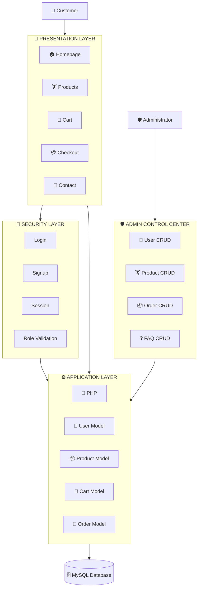
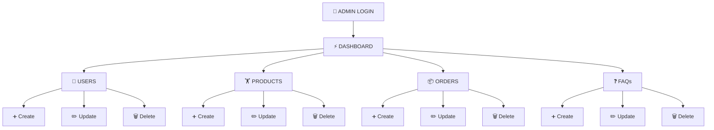
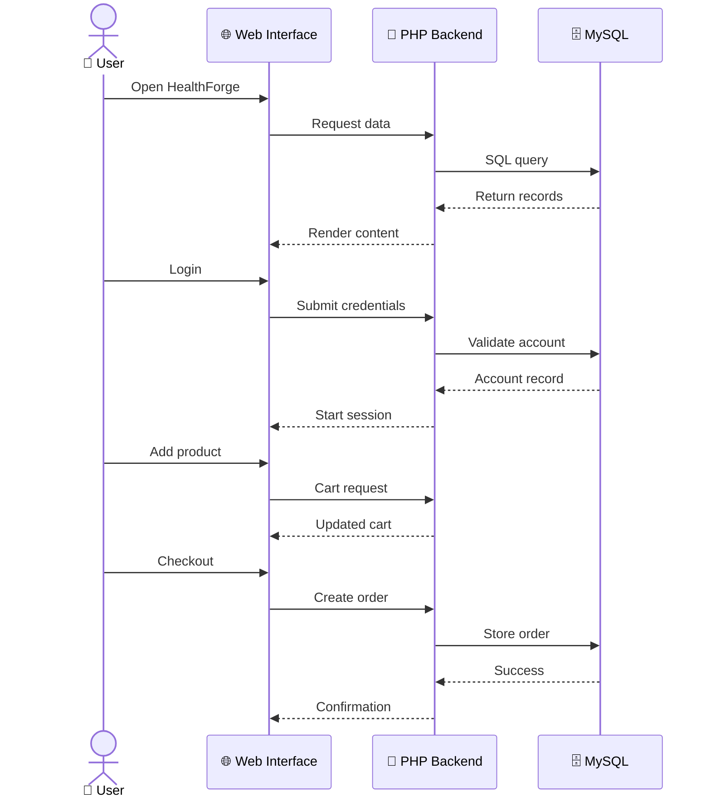
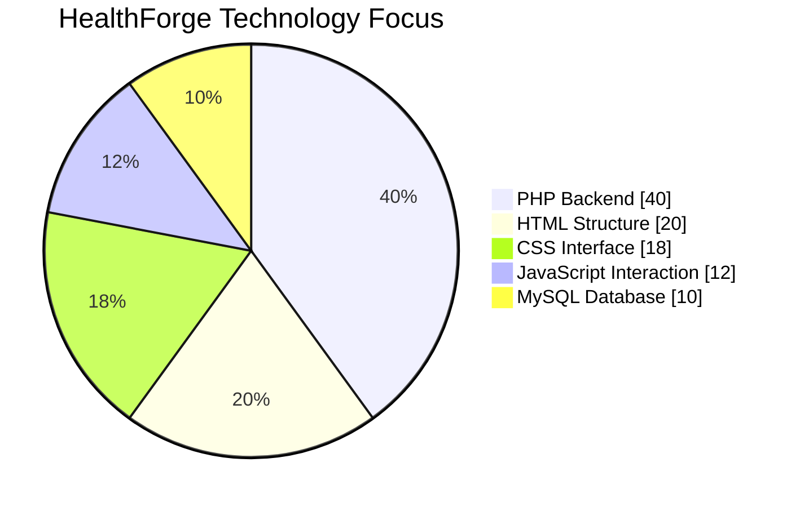
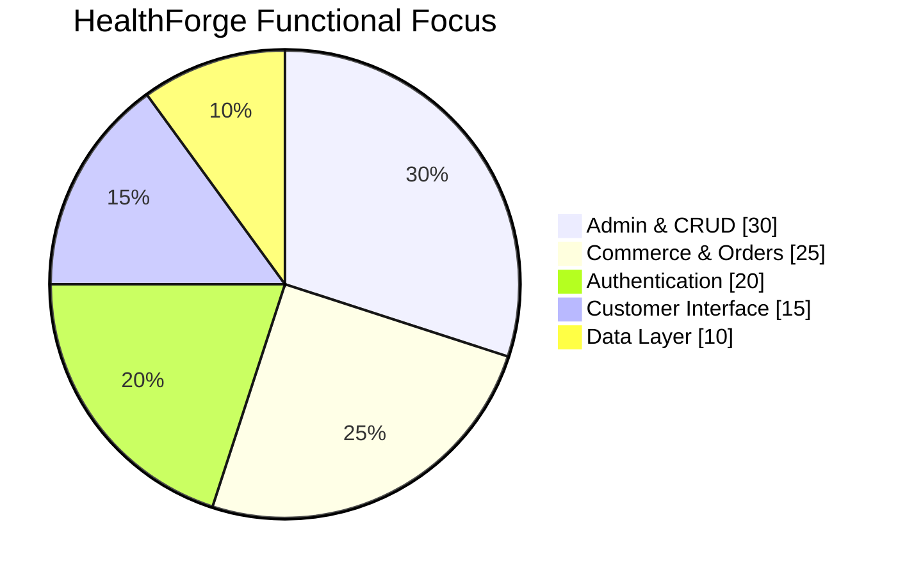
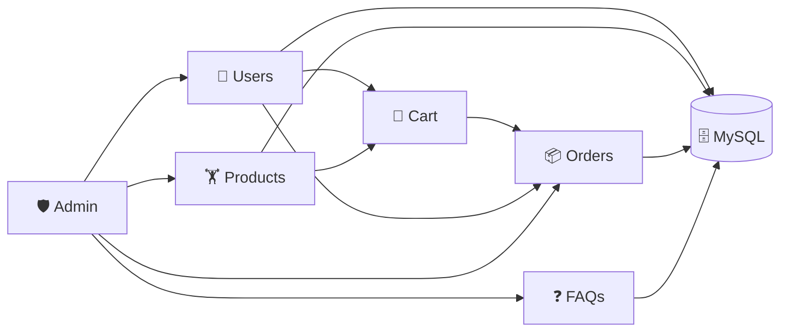
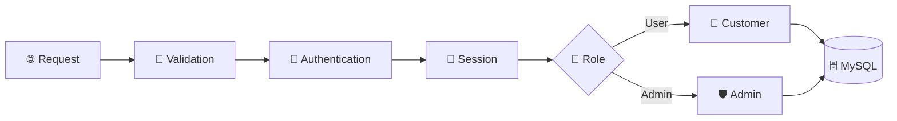
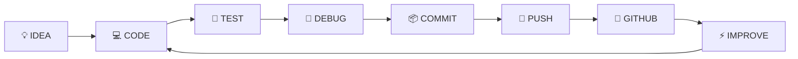
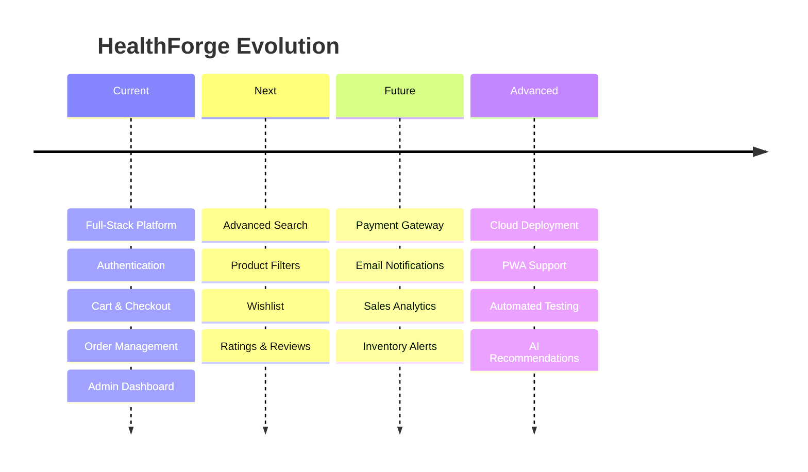

<div align="center">

# 🟢 H E A L T H F O R G E

### 🏋️ FITNESS × 💻 TECHNOLOGY × 🛒 E-COMMERCE × ❤️ HEALTH

<br>


<br><br>


<br>


<br>

[](https://github.com/Ahamed369/HealthForge-Fitness-Web-Application)
[](https://github.com/Ahamed369/HealthForge-Fitness-Web-Application/commits/main)
[](https://github.com/Ahamed369/HealthForge-Fitness-Web-Application/stargazers)
[](https://github.com/Ahamed369/HealthForge-Fitness-Web-Application/forks)
[](https://github.com/Ahamed369/HealthForge-Fitness-Web-Application/issues)

<br>

### 💚 `FORGE YOUR FITNESS • POWER YOUR HEALTH`

</div>

---

<div align="center">

## ⚡ SYSTEM BOOT SEQUENCE


</div>

```console
healthforge@system:~$ system-status

╔══════════════════════════════════════════════════════╗
║               HEALTHFORGE SYSTEM                    ║
╠══════════════════════════════════════════════════════╣
║  🌐 Frontend Interface        [ ONLINE ]            ║
║  🐘 PHP Backend               [ ONLINE ]            ║
║  🗄️ MySQL Database            [ CONNECTED ]         ║
║  🔐 Authentication            [ ACTIVE ]            ║
║  🛒 Shopping Cart             [ ACTIVE ]            ║
║  💳 Checkout Engine           [ READY ]             ║
║  📦 Order Management          [ READY ]             ║
║  🛡️ Admin Dashboard           [ ONLINE ]            ║
╚══════════════════════════════════════════════════════╝

STATUS → ALL SYSTEMS OPERATIONAL ⚡
```

---

# 🌟 About HealthForge

**HealthForge** is a full-stack fitness and health e-commerce web application designed to combine fitness, wellness and technology within one digital platform.

The system provides a customer-facing fitness store alongside authentication, shopping-cart functionality, checkout, order processing, product management, FAQ management, user administration and a dedicated admin dashboard.

```text
                    🏋️ HEALTHFORGE
                           │
          ┌────────────────┼────────────────┐
          │                │                │
          ▼                ▼                ▼
     🎨 FRONTEND       ⚙️ BACKEND       🗄️ DATABASE
          │                │                │
     HTML • CSS           PHP             MySQL
     JavaScript            │                │
          │                │                │
          └────────────────┼────────────────┘
                           ▼
                   🛒 E-COMMERCE
                           │
             ┌─────────────┼─────────────┐
             ▼             ▼             ▼
          Products        Cart         Orders
```

---

# 🎯 Project Mission

<div align="center">

### `FITNESS + SOFTWARE + DATA + COMMERCE`

### ↓

## ⚡ COMPLETE DIGITAL FITNESS PLATFORM ⚡

</div>

HealthForge demonstrates the practical integration of frontend development, backend processing, database engineering, authentication, CRUD operations and e-commerce workflows.

---

# 🚀 Feature Matrix

| 🧩 System         | ⚡ Capability                      |  🚦 Status  |
| ----------------- | --------------------------------- | :---------: |
| 🏠 Homepage       | Fitness-focused landing interface | 🟢 Complete |
| 👤 Registration   | New customer account creation     | 🟢 Complete |
| 🔐 Authentication | Login, logout & sessions          | 🟢 Complete |
| 🏋️ Products      | Product catalogue                 | 🟢 Complete |
| 🛒 Cart           | Add, remove & update items        | 🟢 Complete |
| 💳 Checkout       | Checkout processing               | 🟢 Complete |
| 📦 Orders         | Customer order management         | 🟢 Complete |
| 👥 Users          | Administrative user CRUD          | 🟢 Complete |
| 📦 Products       | Administrative product CRUD       | 🟢 Complete |
| 🧾 Orders         | Administrative order CRUD         | 🟢 Complete |
| ❓ FAQ             | FAQ management                    | 🟢 Complete |
| 🖼️ Uploads       | Product image handling            | 🟢 Complete |
| 📨 Contact        | Customer contact interface        | 🟢 Complete |
| 🗄️ Database      | MySQL persistence                 | 🟢 Complete |

---

# 🧠 System Architecture



---

# 🛒 Customer Journey


---

# 🛡️ Admin Control Center



---

# 🧬 Request Lifecycle



---

# 🎨 Technology Stack

<div align="center">

### FRONTEND


### BACKEND


### DATABASE


### DEVELOPMENT


</div>

---

# 📊 Technology Architecture



> ℹ️ This chart is an illustrative architectural breakdown rather than measured GitHub language statistics.

---

# 📊 Functional Architecture



---

# 📈 Development Matrix

```text
╔══════════════════════════════════════════════════════════════════╗
║                    ENGINEERING MATRIX                            ║
╠══════════════════════════════════════════════════════════════════╣
║                                                                  ║
║ PHP Backend             ████████████████████  CORE              ║
║ MySQL Integration       ████████████████████  CORE              ║
║ CRUD Operations         ████████████████████  CORE              ║
║ Authentication          ███████████████████░  ADVANCED          ║
║ Admin Management        ███████████████████░  ADVANCED          ║
║ E-Commerce Workflow     ███████████████████░  ADVANCED          ║
║ Frontend Engineering    ██████████████████░░  STRONG            ║
║ JavaScript              █████████████████░░░  STRONG            ║
║ Git / GitHub            ██████████████████░░  STRONG            ║
║                                                                  ║
╚══════════════════════════════════════════════════════════════════╝
```

These bars represent the project's technical focus rather than benchmark scores.

---

# 🔥 Skills Demonstrated

### 🐘 Backend Engineering

`PHP` • `PDO` • `Sessions` • `Authentication` • `CRUD` • `Password Hashing` • `Server-Side Processing`

### 🎨 Frontend Engineering

`HTML5` • `CSS3` • `JavaScript` • `Responsive Design` • `DOM Interaction`

### 🗄️ Database Engineering

`MySQL` • `SQL` • `Relational Data` • `Queries` • `Data Persistence`

### ⚙️ Software Engineering

`Git` • `GitHub` • `Modular Architecture` • `Debugging` • `Full-Stack Development`

---

# 🗄️ Database Ecosystem



---

# 🔐 Security Architecture



### Security Foundations

```text
🔐 Password Hashing
🎫 Session Authentication
👥 Role-Based Structure
🗄️ PDO Connectivity
⚙️ Server-Side Processing
🔍 Authentication Validation
🛡️ Administrative Access
```

---

# 🧩 CRUD Matrix

| Module       | ➕ Create | 👁️ Read | ✏️ Update | 🗑️ Delete |
| ------------ | :------: | :------: | :-------: | :--------: |
| 👥 Users     |     ✅    |     ✅    |     ✅     |      ✅     |
| 🏋️ Products |     ✅    |     ✅    |     ✅     |      ✅     |
| 📦 Orders    |     ✅    |     ✅    |     ✅     |      ✅     |
| ❓ FAQs       |     ✅    |     ✅    |     ✅     |      ✅     |
| 🛒 Cart      |     ✅    |     ✅    |     ✅     |      ✅     |

---

# 🖼️ HealthForge Product Gallery

Instead of linking to nonexistent screenshots, this section uses **real images already stored in this repository**.

<div align="center">

<table>
<tr>
<td align="center"><b>Whey Protein</b></td>
<td align="center"><b>Dumbbell</b></td>
<td align="center"><b>Treadmill</b></td>
</tr>

<tr>
<td></td>
<td></td>
<td></td>
</tr>

<tr>
<td align="center"><b>Fitness Tracker</b></td>
<td align="center"><b>Yoga Mat</b></td>
<td align="center"><b>Massage Gun</b></td>
</tr>

<tr>
<td></td>
<td></td>
<td></td>
</tr>
</table>

</div>

---

# 📁 Project Architecture

<details>
<summary><b>📂 CLICK TO EXPLORE THE HEALTHFORGE FILE STRUCTURE</b></summary>

<br>

```text
HealthForge-Fitness-Web-Application/
│
├── 📁 admin/
│   ├── admin.php
│   ├── admin_header.php
│   ├── admin-users.php
│   ├── admin-products.php
│   ├── admin-orders.php
│   ├── admin-faq.php
│   ├── create_user.php
│   ├── create_product.php
│   ├── create_order.php
│   ├── create_faq.php
│   ├── update_user.php
│   ├── update_product.php
│   ├── update_order.php
│   ├── update_faq.php
│   ├── delete_user.php
│   ├── delete_product.php
│   ├── delete_order.php
│   ├── delete_faq.php
│   ├── get_order_details.php
│   └── upload_image.php
│
├── 📁 auth/
│   ├── login.php
│   ├── signup.php
│   ├── logout.php
│   └── check_status.php
│
├── 📁 cart/
│   ├── add_to_cart.php
│   ├── checkout.php
│   ├── clear_cart.php
│   ├── get_cart.php
│   ├── remove_from_cart.php
│   └── update_cart.php
│
├── 📁 config/
│   └── database.php
│
├── 📁 css/
│   ├── style.css
│   ├── admin.css
│   ├── aboutus.css
│   └── contact.css
│
├── 📁 images/
│   └── HealthForge product assets
│
├── 📁 js/
│   ├── app.js
│   ├── admin.js
│   └── contact.js
│
├── 📁 models/
│   ├── User.php
│   ├── Product.php
│   ├── Cart.php
│   └── Order.php
│
├── 📁 orders/
│   └── get_user_orders.php
│
├── 📁 products/
│   └── get_products.php
│
├── 📄 index.php
├── 📄 products.php
├── 📄 aboutus.php
├── 📄 contact.php
├── 🗄️ healthforge.sql
├── 🔐 generate_password_hash.php
├── 📄 .gitignore
└── 📖 README.md
```

</details>

---

# 🎮 Developer Quest

```text
╔══════════════════════════════════════════════════════════╗
║                🎮 HEALTHFORGE QUEST                     ║
╠══════════════════════════════════════════════════════════╣
║                                                          ║
║  QUEST 01  🎨 Build Frontend                  [✓]        ║
║  QUEST 02  🐘 Forge PHP Backend               [✓]        ║
║  QUEST 03  🗄️ Connect MySQL                   [✓]        ║
║  QUEST 04  🔐 Build Authentication            [✓]        ║
║  QUEST 05  🏋️ Build Product Engine            [✓]        ║
║  QUEST 06  🛒 Build Shopping Cart             [✓]        ║
║  QUEST 07  💳 Build Checkout                  [✓]        ║
║  QUEST 08  📦 Build Order System              [✓]        ║
║  QUEST 09  🛡️ Build Admin Dashboard           [✓]        ║
║  QUEST 10  ⚙️ Complete CRUD                    [✓]        ║
║                                                          ║
║             🏆 ALL MAIN QUESTS COMPLETE 🏆              ║
╚══════════════════════════════════════════════════════════╝
```

---

# 🕹️ Developer Profile

```console
PLAYER@HEALTHFORGE:~$ whoami

👨‍💻 M.R. AHAMED

PLAYER@HEALTHFORGE:~$ class

⚡ Full-Stack Developer
🎓 Computer Science Undergraduate
💼 Entrepreneur

PLAYER@HEALTHFORGE:~$ weapons

🐘 PHP
🗄️ MySQL
⚡ JavaScript
🌐 HTML5
🎨 CSS3
🔀 Git
🐙 GitHub

PLAYER@HEALTHFORGE:~$ current-mission

🏋️ HEALTHFORGE FITNESS WEB APPLICATION

PLAYER@HEALTHFORGE:~$ status

🚀 READY TO BUILD
```

---

# 🚀 Installation

<details>

<summary><b>1️⃣ CLONE HEALTHFORGE</b></summary>

<br>

```bash
git clone https://github.com/Ahamed369/HealthForge-Fitness-Web-Application.git
cd HealthForge-Fitness-Web-Application
```

</details>

<details>

<summary><b>2️⃣ CONFIGURE LOCAL SERVER</b></summary>

<br>

Use:

```text
XAMPP
WAMP
MAMP
or PHP + MySQL
```

For XAMPP:

```text
C:\xampp\htdocs\HealthForge-Fitness-Web-Application\
```

Start:

```text
Apache → START
MySQL  → START
```

</details>

<details>

<summary><b>3️⃣ CREATE DATABASE</b></summary>

<br>

Open phpMyAdmin:

```text
http://localhost/phpmyadmin
```

Create:

```sql
CREATE DATABASE healthforge;
```

Import:

```text
healthforge.sql
```

</details>

<details>

<summary><b>4️⃣ DATABASE CONFIGURATION</b></summary>

<br>

Default local setup:

```php
private $host = "localhost";
private $db_name = "healthforge";
private $username = "root";
private $password = "";
```

> ⚠️ Never commit real production passwords or private credentials.

</details>

<details>

<summary><b>5️⃣ LAUNCH HEALTHFORGE</b></summary>

<br>

```text
http://localhost/HealthForge-Fitness-Web-Application/
```

</details>

---

# 🔄 Development Lifecycle



---

# 🔮 Evolution Roadmap



---

# 💡 Future Enhancements

| Area              | Enhancement               |
| ----------------- | ------------------------- |
| 💳 Payments       | Online payment gateway    |
| 📧 Communication  | Automated emails          |
| 🔎 Discovery      | Advanced product search   |
| 🎯 Filtering      | Smart product filters     |
| ❤️ Engagement     | Wishlist                  |
| ⭐ Community       | Ratings & reviews         |
| 📊 Analytics      | Admin analytics dashboard |
| 📈 Business       | Sales visualization       |
| 📦 Inventory      | Stock alerts              |
| 🧾 Documents      | Invoice generation        |
| 🔐 Security       | CSRF protection           |
| 🔑 Accounts       | Password recovery         |
| 📱 Mobile         | Progressive Web App       |
| ☁️ Infrastructure | Cloud deployment          |
| 🧪 Quality        | Automated testing         |
| 🌙 UX             | Dark mode                 |
| 🤖 AI             | Product recommendations   |

---

# 🏆 Achievement Board

<div align="center">


</div>

---

# 👨‍💻 Developer

<div align="center">


<br>

## M.R. Ahamed

**Computer Science Undergraduate • Full-Stack Developer • Entrepreneur**

<br>

[](https://github.com/Ahamed369)

[](https://www.linkedin.com/in/mr-ahamed-6146a5276)

</div>

---

# 🤝 Contributing

```bash
# Fork the repository

git clone https://github.com/YOUR-USERNAME/HealthForge-Fitness-Web-Application.git

cd HealthForge-Fitness-Web-Application

git checkout -b feature/amazing-feature

git add .

git commit -m "Add amazing feature"

git push origin feature/amazing-feature
```

Then open a Pull Request.

---

# ⭐ Support HealthForge

<div align="center">

### If HealthForge helped or inspired you:

⭐ **STAR** • 🍴 **FORK** • 🐛 **REPORT** • 💡 **SUGGEST** • 🤝 **CONTRIBUTE**

<br>

[](https://github.com/Ahamed369/HealthForge-Fitness-Web-Application/stargazers)

[](https://github.com/Ahamed369/HealthForge-Fitness-Web-Application/forks)

</div>

---

<div align="center">

# ⚡ HEALTHFORGE ⚡


<br><br>

[](https://github.com/Ahamed369/HealthForge-Fitness-Web-Application)

<br><br>

```text
╔══════════════════════════════════════════════════════════╗
║                                                          ║
║                 🏋️  HEALTHFORGE  ⚡                     ║
║                                                          ║
║           BUILT WITH PASSION × CODE × FITNESS            ║
║                                                          ║
╚══════════════════════════════════════════════════════════╝
```

### `</ HEALTHFORGE >`

**Designed & Developed by M.R. Ahamed**

`PHP` • `MySQL` • `JavaScript` • `HTML5` • `CSS3` • `Git` • `GitHub`

**© 2026 M.R. Ahamed • HealthForge**

### ⭐ STAR THE REPOSITORY IF YOU LIKE HEALTHFORGE ⭐

</div>
