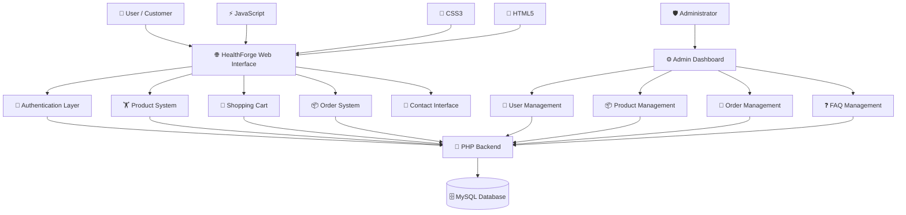
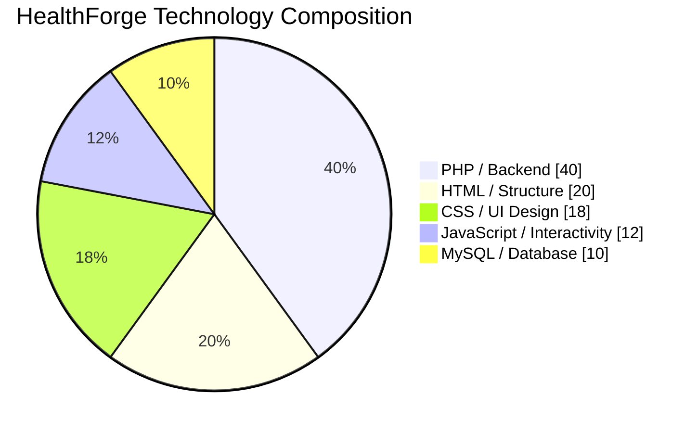
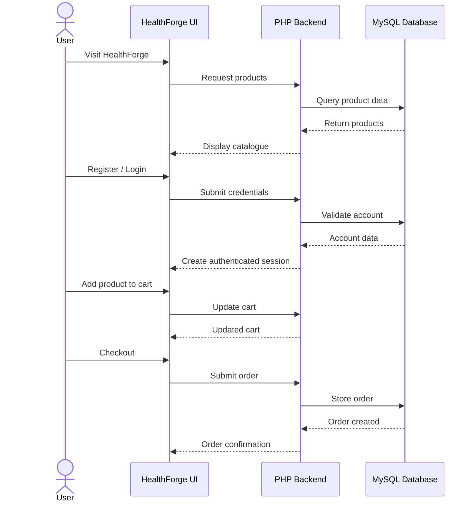
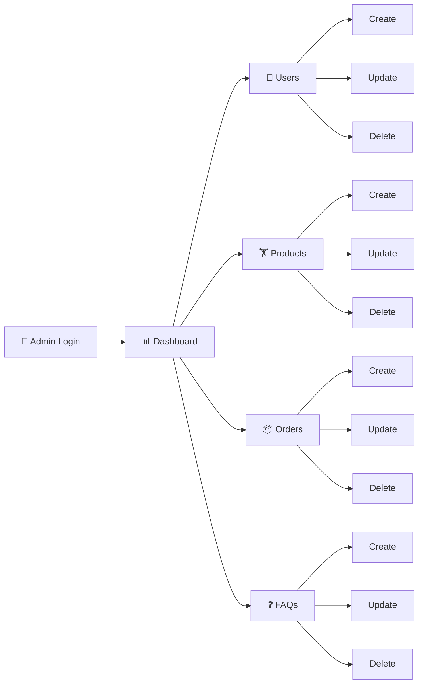
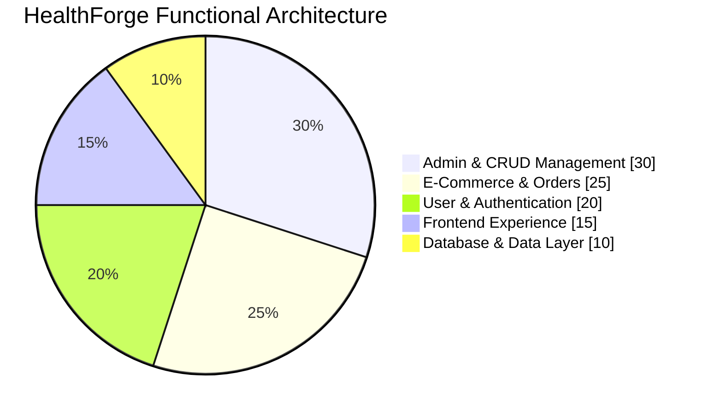

<div align="center">

# 🏋️ HEALTHFORGE

### Fitness • Health • Performance • E-Commerce

<p>
  <strong>A modern full-stack fitness and health e-commerce platform built to make fitness products, wellness essentials, and order management simple, fast, and accessible.</strong>
</p>

<br/>


<br/><br/>

[](https://www.php.net/)
[](https://www.mysql.com/)
[](https://developer.mozilla.org/en-US/docs/Web/JavaScript)
[](https://developer.mozilla.org/en-US/docs/Web/HTML)
[](https://developer.mozilla.org/en-US/docs/Web/CSS)

<br/>

[](https://github.com/Ahamed369/HealthForge-Fitness-Web-Application)
[](https://github.com/Ahamed369/HealthForge-Fitness-Web-Application/commits/main)
[](https://github.com/Ahamed369/HealthForge-Fitness-Web-Application/stargazers)
[](https://github.com/Ahamed369/HealthForge-Fitness-Web-Application/forks)
[](https://github.com/Ahamed369/HealthForge-Fitness-Web-Application/issues)

<br/>


</div>

---

## ⚡ About HealthForge

**HealthForge** is a full-stack fitness and health e-commerce web application designed to provide users with a convenient digital platform for discovering and purchasing fitness, wellness, recovery, and health-related products.

The application combines a responsive customer-facing storefront with authentication, shopping-cart functionality, checkout and order processing, product management, user management, FAQ administration, and a dedicated administrative dashboard.

HealthForge demonstrates the implementation of both **front-end and back-end web development concepts**, including dynamic PHP pages, relational database operations, CRUD functionality, session-based authentication, responsive interfaces, JavaScript-driven interactions, and structured application architecture.

> **HealthForge is more than a storefront — it is a complete fitness-commerce management ecosystem.**

---

# ✨ Core Features

<table>
<tr>
<td width="50%" valign="top">

### 🛍️ Customer Experience

* Modern fitness-oriented homepage
* Product catalogue
* Dynamic product loading
* Product information
* Fitness and wellness categories
* Shopping cart
* Add-to-cart functionality
* Quantity management
* Remove cart items
* Clear cart
* Checkout workflow
* Order placement
* User order history
* Responsive user interface

</td>

<td width="50%" valign="top">

### 🔐 Account System

* User registration
* Secure user login
* Logout functionality
* Session handling
* Authentication status checking
* User account management
* Password hashing
* Role-based user structure
* Admin/user separation
* Database-backed accounts

</td>
</tr>

<tr>
<td width="50%" valign="top">

### 📦 Order & Product Management

* Product creation
* Product editing
* Product deletion
* Product image uploading
* Order creation
* Order updates
* Order deletion
* Order-detail retrieval
* Shopping-cart management
* Database-driven inventory data

</td>

<td width="50%" valign="top">

### 🛡️ Administration

* Dedicated admin dashboard
* User management
* Product management
* Order management
* FAQ management
* CRUD operations
* Create/update/delete users
* Create/update/delete products
* Create/update/delete orders
* Create/update/delete FAQs

</td>
</tr>
</table>

---

# 🧠 System Architecture



---

# 🛠️ Technology Stack

<div align="center">

|          Layer         | Technologies                        |
| :--------------------: | :---------------------------------- |
|     🎨 **Frontend**    | HTML5 • CSS3 • JavaScript           |
|     ⚙️ **Backend**     | PHP                                 |
|    🗄️ **Database**    | MySQL                               |
|  🔐 **Authentication** | PHP Sessions • Password Hashing     |
|  🔄 **Data Handling**  | PHP • PDO • MySQL                   |
|   🧩 **Architecture**  | Modular PHP • Model-Based Structure |
|     🛒 **Commerce**    | Cart • Checkout • Orders            |
| 🛡️ **Administration** | CRUD Management Dashboard           |
| 🔧 **Version Control** | Git • GitHub                        |
|   💻 **Development**   | Visual Studio Code                  |

</div>

---

# 📊 Technology Distribution



> The chart above is a **high-level architectural illustration**, not a GitHub language-statistics measurement.

---

# 📈 Development Focus

```text
Backend Development        ████████████████████  100%
Database Integration       ███████████████████░   95%
CRUD Operations            ███████████████████░   95%
Authentication             ██████████████████░░   90%
Admin Management           ██████████████████░░   90%
Frontend Development       █████████████████░░░   85%
Responsive UI              █████████████████░░░   85%
JavaScript Interaction     ████████████████░░░░   80%
E-Commerce Workflow        ██████████████████░░   90%
```

> These bars describe the **functional focus of the project** rather than measured performance scores.

---

# 🔥 Technical Skills Demonstrated

<div align="center">


</div>

### Backend Engineering

`PHP` `PDO` `Sessions` `Authentication` `Authorization` `CRUD` `Server-Side Validation` `Password Hashing`

### Frontend Engineering

`HTML5` `CSS3` `JavaScript` `Responsive Design` `DOM Manipulation` `Interactive UI`

### Database Engineering

`MySQL` `SQL` `Relational Database Design` `Database Integration` `Queries` `Data Management`

### Software Development

`Git` `GitHub` `Modular Development` `Debugging` `Requirement Implementation` `Full-Stack Development`

---

# 🗂️ Project Structure

```text
HealthForge-Fitness-Web-Application/
│
├── 📁 admin/
│   ├── admin.php
│   ├── admin_header.php
│   ├── admin-users.php
│   ├── admin-products.php
│   ├── admin-orders.php
│   ├── admin-faq.php
│   ├── create_user.php
│   ├── create_product.php
│   ├── create_order.php
│   ├── create_faq.php
│   ├── update_user.php
│   ├── update_product.php
│   ├── update_order.php
│   ├── update_faq.php
│   ├── delete_user.php
│   ├── delete_product.php
│   ├── delete_order.php
│   ├── delete_faq.php
│   ├── get_order_details.php
│   └── upload_image.php
│
├── 📁 auth/
│   ├── login.php
│   ├── signup.php
│   ├── logout.php
│   └── check_status.php
│
├── 📁 cart/
│   ├── add_to_cart.php
│   ├── checkout.php
│   ├── clear_cart.php
│   ├── get_cart.php
│   ├── remove_from_cart.php
│   └── update_cart.php
│
├── 📁 config/
│   └── database.php
│
├── 📁 css/
│   ├── style.css
│   ├── admin.css
│   ├── aboutus.css
│   └── contact.css
│
├── 📁 images/
│   └── Product & interface assets
│
├── 📁 js/
│   ├── app.js
│   ├── admin.js
│   └── contact.js
│
├── 📁 models/
│   ├── User.php
│   ├── Product.php
│   ├── Cart.php
│   └── Order.php
│
├── 📁 orders/
│   └── get_user_orders.php
│
├── 📁 products/
│   └── get_products.php
│
├── 📄 index.php
├── 📄 products.php
├── 📄 aboutus.php
├── 📄 contact.php
├── 🗄️ healthforge.sql
├── 🔐 generate_password_hash.php
└── 📄 .gitignore
```

---

# 🔄 Application Workflow



---

# 🛡️ Admin Workflow



---

# 🗄️ Database Layer

HealthForge uses **MySQL** as its relational database system.

Core data areas include:

```text
👤 Users
   │
   ├── Authentication
   ├── User Roles
   └── Account Information

🏋️ Products
   │
   ├── Product Details
   ├── Pricing
   ├── Images
   └── Inventory Information

🛒 Cart
   │
   ├── Selected Products
   └── Quantities

📦 Orders
   │
   ├── Customer Information
   ├── Order Details
   └── Order Status

❓ FAQs
   │
   └── Administrative Content
```

---

# 🔐 Authentication & Security

HealthForge includes several application-security foundations:

* Password hashing
* PHP session-based authentication
* User-role separation
* Admin/user access structure
* PDO-based database connectivity
* Server-side processing
* Authentication status validation
* Controlled administrative functionality

> Production deployments should additionally use environment variables for credentials, HTTPS, hardened session settings, comprehensive input validation, CSRF protection, secure HTTP headers, and production-specific database credentials.

---

# 🚀 Installation & Setup

## 1️⃣ Clone the Repository

```bash
git clone https://github.com/Ahamed369/HealthForge-Fitness-Web-Application.git
```

Move into the project:

```bash
cd HealthForge-Fitness-Web-Application
```

---

## 2️⃣ Install a Local PHP Environment

You can use:

* XAMPP
* WAMP
* MAMP
* Native PHP + MySQL

For XAMPP, place the project inside:

```text
xampp/htdocs/
```

Example:

```text
C:/xampp/htdocs/HealthForge-Fitness-Web-Application/
```

---

## 3️⃣ Start Required Services

Start:

```text
Apache
MySQL
```

---

## 4️⃣ Create the Database

Open:

```text
http://localhost/phpmyadmin
```

Create a database named:

```sql
healthforge
```

Then import:

```text
healthforge.sql
```

---

## 5️⃣ Database Configuration

Default local configuration:

```php
private $host = "localhost";
private $db_name = "healthforge";
private $username = "root";
private $password = "";
```

For a real deployment, use environment-specific credentials rather than publishing production secrets.

---

## 6️⃣ Launch HealthForge

Open:

```text
http://localhost/HealthForge-Fitness-Web-Application/
```

Depending on the folder name used inside `htdocs`, your local URL may differ.

---

# 🛒 E-Commerce Journey


---

# 📊 Functional Distribution



> Percentages are an **illustrative breakdown of project functionality**, not measured code percentages.

---

# 📸 Screenshots

<div align="center">

### 🏠 Homepage

> Add your HealthForge homepage screenshot here.

```html

```

### 🏋️ Products

> Add your product-page screenshot here.

```html

```

### 🛡️ Admin Dashboard

> Add your admin-dashboard screenshot here.

```html

```

</div>

---

# 🧪 Major Modules

| Module            | Purpose                              | Status |
| ----------------- | ------------------------------------ | :----: |
| 🏠 Homepage       | Main HealthForge customer experience |    ✅   |
| 👤 Authentication | Login, signup and logout             |    ✅   |
| 🏋️ Products      | Product catalogue and retrieval      |    ✅   |
| 🛒 Cart           | Cart management                      |    ✅   |
| 💳 Checkout       | Order checkout workflow              |    ✅   |
| 📦 Orders         | Customer order management            |    ✅   |
| 👥 Admin Users    | User CRUD management                 |    ✅   |
| 📦 Admin Products | Product CRUD management              |    ✅   |
| 🧾 Admin Orders   | Order CRUD management                |    ✅   |
| ❓ Admin FAQ       | FAQ CRUD management                  |    ✅   |
| 📨 Contact        | Customer contact interface           |    ✅   |
| 🗄️ Database      | MySQL data persistence               |    ✅   |

---

# 💡 Key Development Concepts

This project demonstrates practical knowledge of:

```text
✓ Full-Stack Web Development
✓ PHP Backend Development
✓ MySQL Database Integration
✓ Object-Oriented / Model-Based PHP Structure
✓ CRUD Operations
✓ Authentication & Sessions
✓ Password Hashing
✓ Role-Based Application Structure
✓ Shopping Cart Logic
✓ Checkout Processing
✓ Order Management
✓ Product Management
✓ User Management
✓ FAQ Management
✓ Responsive Web Design
✓ JavaScript Interactivity
✓ Git Version Control
✓ GitHub Repository Management
```

---

# 🎯 Project Objectives

HealthForge was developed to demonstrate how a complete fitness-oriented commerce platform can integrate:

**Customer Experience**

```text
Discover → Browse → Add to Cart → Checkout → Order
```

**Administration**

```text
Login → Dashboard → Manage Users / Products / Orders / FAQs
```

**Application Layer**

```text
Frontend → PHP Logic → PDO → MySQL
```

The result is a structured full-stack application combining UI development, backend processing, database management, authentication, CRUD operations, and e-commerce functionality.

---

# 🌟 Future Enhancements

Potential future development includes:

* 💳 Online payment-gateway integration
* 📧 Automated email notifications
* 🔍 Advanced product search
* 🎯 Product filtering
* ❤️ Wishlist functionality
* ⭐ Product reviews and ratings
* 📊 Advanced admin analytics
* 📈 Sales visualization
* 📦 Inventory alerts
* 🧾 Invoice generation
* 🔐 CSRF protection
* 🔑 Password-reset workflow
* 📱 Progressive Web App support
* ☁️ Cloud deployment
* 🧪 Automated testing
* 🌙 Dark-mode interface
* 🤖 AI-powered fitness-product recommendations

---

# 📈 GitHub Repository Statistics

<div align="center">


</div>

<div align="center">


</div>

---

# 🏆 Project Highlights

<div align="center">

| 💻 Full Stack | 🗄️ Database |    🔐 Security   | 🛒 Commerce |  🛡️ Admin |
| :-----------: | :----------: | :--------------: | :---------: | :--------: |
|    PHP + JS   |     MySQL    |  Authentication  |     Cart    |  Dashboard |
|   HTML + CSS  |      PDO     | Password Hashing |   Checkout  |    CRUD    |
| Responsive UI |      SQL     |     Sessions     |    Orders   | Management |

</div>

---

# 👨‍💻 Developer

<div align="center">

## M.R. Ahamed

**Computer Science Undergraduate • Full-Stack Developer • Entrepreneur**

Building digital products and technology-driven solutions with a focus on modern web development, software engineering, mobile technology, and practical business applications.

<br/>

[](https://github.com/Ahamed369)
[](https://www.linkedin.com/in/mr-ahamed-6146a5276)

</div>

---

# 🤝 Contributions

Contributions, suggestions, and improvements are welcome.

```bash
# Fork the repository

# Create a feature branch
git checkout -b feature/new-feature

# Commit your changes
git commit -m "Add new feature"

# Push the branch
git push origin feature/new-feature
```

Then open a **Pull Request**.

---

# ⭐ Support

If you find **HealthForge** useful or interesting:

```text
⭐ Star the repository
🍴 Fork the project
🐛 Report issues
💡 Suggest improvements
🤝 Contribute
```

Your support helps the project grow.

---

# 📌 Repository

<div align="center">

### HealthForge Fitness Web Application

**Full-Stack Fitness & Health E-Commerce Platform**

[](https://github.com/Ahamed369/HealthForge-Fitness-Web-Application)

</div>

---

<div align="center">

### ⚡ BUILT WITH PASSION FOR FITNESS & TECHNOLOGY ⚡


<br/>

**Designed & Developed by M.R. Ahamed**

`PHP` • `MySQL` • `JavaScript` • `HTML5` • `CSS3`

<br/>

⭐ **Star HealthForge if you like the project!** ⭐

</div>
