<div align="center">

# ⚡🏋️ H E A L T H F O R G E 🏋️⚡

### `FITNESS × HEALTH × TECHNOLOGY × E-COMMERCE`

<br>


<br>

---

### 💚 `FORGE YOUR FITNESS • POWER YOUR HEALTH`

<br>


<br>


<br>

[](https://github.com/Ahamed369/HealthForge-Fitness-Web-Application)
[](https://github.com/Ahamed369/HealthForge-Fitness-Web-Application/commits/main)
[](https://github.com/Ahamed369/HealthForge-Fitness-Web-Application/stargazers)
[](https://github.com/Ahamed369/HealthForge-Fitness-Web-Application/forks)
[](https://github.com/Ahamed369/HealthForge-Fitness-Web-Application/issues)
[](https://github.com/Ahamed369/HealthForge-Fitness-Web-Application/watchers)

<br>

> **A powerful full-stack fitness and health e-commerce platform combining modern customer experiences, secure authentication, product discovery, shopping-cart management, checkout, orders and a complete administrative control center.**

</div>

---

<div align="center">

# 🧬 SYSTEM INITIALIZATION


</div>

```console
healthforge@system:~$ initialize --all

╔════════════════════════════════════════════════════════════╗
║                 HEALTHFORGE SYSTEM CORE                    ║
╠════════════════════════════════════════════════════════════╣
║                                                            ║
║  🌐 Frontend Interface          [ ONLINE ]                 ║
║  🐘 PHP Backend                 [ ONLINE ]                 ║
║  🗄️ MySQL Database              [ CONNECTED ]              ║
║  🔐 Authentication Engine       [ ACTIVE ]                 ║
║  👤 User Management             [ ACTIVE ]                 ║
║  🏋️ Product Engine              [ ACTIVE ]                 ║
║  🛒 Shopping Cart               [ ACTIVE ]                 ║
║  💳 Checkout Engine             [ READY ]                  ║
║  📦 Order Management            [ READY ]                  ║
║  ❓ FAQ Management              [ READY ]                  ║
║  🛡️ Admin Control Center        [ ONLINE ]                 ║
║                                                            ║
╚════════════════════════════════════════════════════════════╝

SYSTEM STATUS → ALL SYSTEMS OPERATIONAL ⚡
```

---

# 🧭 Navigation

<div align="center">

`ABOUT`
•
`FEATURES`
•
`ARCHITECTURE`
•
`TECH STACK`
•
`DATABASE`
•
`SECURITY`
•
`INSTALLATION`
•
`ANALYTICS`
•
`QUEST`
•
`ROADMAP`
•
`DEVELOPER`

</div>

---

# ⚡ About HealthForge

**HealthForge** is a full-stack fitness and health e-commerce web application designed to provide users with a convenient digital platform for discovering and purchasing fitness, wellness, recovery and health-related products.

The application combines a responsive customer-facing storefront with:

* 🏋️ Fitness and wellness product discovery
* 👤 User registration and authentication
* 🔐 Session-based account management
* 🛒 Shopping-cart functionality
* 💳 Checkout processing
* 📦 Order management
* 👥 User administration
* 🏋️ Product administration
* ❓ FAQ administration
* 🖼️ Product-image handling
* 🛡️ Dedicated administrative dashboard
* 🗄️ MySQL database persistence

HealthForge demonstrates practical implementation of **frontend engineering, backend development, relational database integration, authentication, CRUD operations, e-commerce logic and Git-based software development**.

<div align="center">

### 🏋️ `FITNESS MEETS SOFTWARE ENGINEERING`

### ⚡ `CODE × HEALTH × COMMERCE`

</div>

---

# 🎯 HealthForge Mission

```text
╔══════════════════════════════════════════════════════════════╗
║                                                              ║
║                     ⚡ HEALTHFORGE ⚡                        ║
║                                                              ║
║        FITNESS  +  SOFTWARE  +  DATA  +  COMMERCE           ║
║                                                              ║
║                           ↓                                  ║
║                                                              ║
║             COMPLETE DIGITAL FITNESS PLATFORM                ║
║                                                              ║
╚══════════════════════════════════════════════════════════════╝
```

---

# 🚀 Feature Universe

<table>

<tr>

<td width="33%" valign="top">

### 🛍️ Storefront

✔ Fitness products
✔ Wellness products
✔ Product catalogue
✔ Dynamic product retrieval
✔ Product information
✔ Product imagery
✔ Responsive interface

</td>

<td width="33%" valign="top">

### 👤 Authentication

✔ User registration
✔ Secure login
✔ Logout
✔ PHP sessions
✔ Password hashing
✔ Authentication status
✔ User/admin roles

</td>

<td width="33%" valign="top">

### 🛒 Shopping Cart

✔ Add products
✔ View cart
✔ Update quantities
✔ Remove items
✔ Clear cart
✔ Cart calculations
✔ Checkout integration

</td>

</tr>

<tr>

<td width="33%" valign="top">

### 📦 Orders

✔ Checkout
✔ Order creation
✔ Order history
✔ Order details
✔ Order updates
✔ Administrative management

</td>

<td width="33%" valign="top">

### 🛡️ Administration

✔ Admin dashboard
✔ User management
✔ Product management
✔ Order management
✔ FAQ management
✔ Image uploads
✔ Complete CRUD

</td>

<td width="33%" valign="top">

### 🗄️ Data Layer

✔ MySQL
✔ PDO connectivity
✔ Relational data
✔ SQL queries
✔ Data persistence
✔ Structured models

</td>

</tr>

</table>

---

# 🧠 HealthForge System Architecture

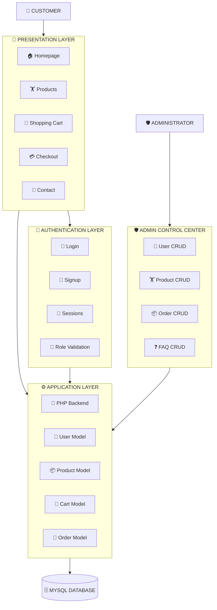

---

# 🌐 Request Lifecycle

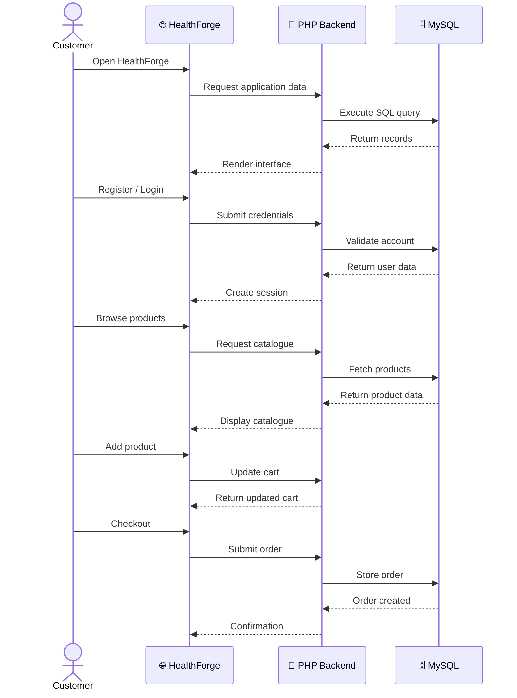

---

# 🛒 Customer Journey


---

# 🛡️ Admin Workflow

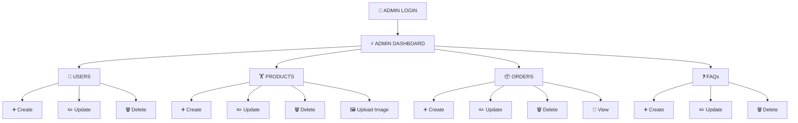

---

# 🧰 Technology Arsenal

<div align="center">

## 🎨 FRONTEND


## ⚙️ BACKEND


## 🗄️ DATABASE


## 🛠️ DEVELOPMENT


</div>

---

# 🔥 Technical Skills Demonstrated

### ⚙️ Backend Engineering

`PHP`
`PDO`
`CRUD`
`Sessions`
`Authentication`
`Authorization`
`Password Hashing`
`Server-Side Processing`

### 🎨 Frontend Engineering

`HTML5`
`CSS3`
`JavaScript`
`Responsive Design`
`DOM Manipulation`
`Interactive UI`

### 🗄️ Database Engineering

`MySQL`
`SQL`
`Relational Database Design`
`Database Integration`
`Data Persistence`
`Queries`

### 🧠 Software Engineering

`Git`
`GitHub`
`Modular Architecture`
`Debugging`
`Full-Stack Development`
`Requirement Implementation`

---

# 📊 Technology Composition

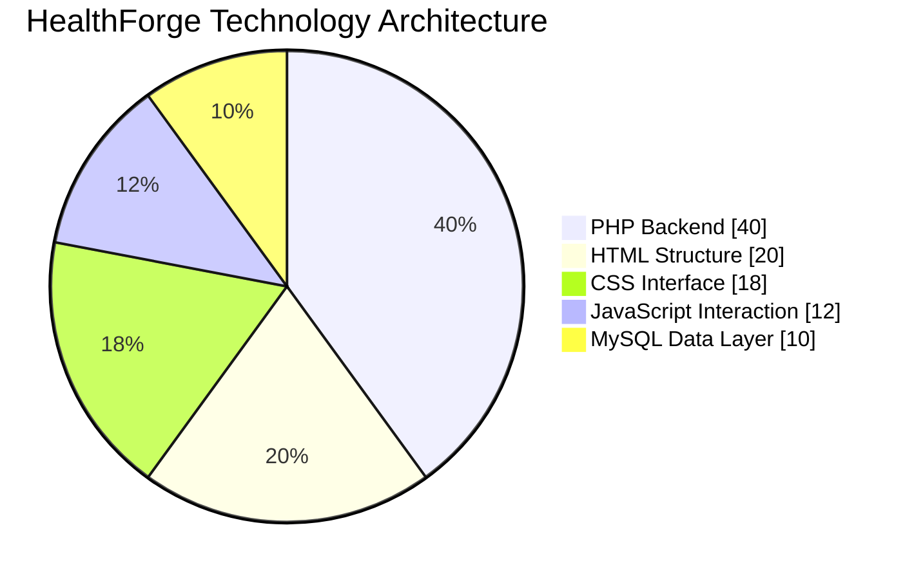

> 📌 This is an illustrative architectural distribution rather than measured GitHub language statistics.

---

# 📊 Functional Composition

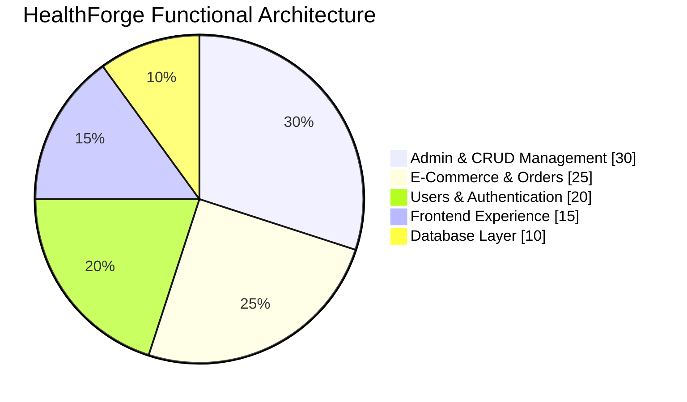

---

# 📈 Engineering Power Matrix

```text
╔══════════════════════════════════════════════════════════════════╗
║                 ⚡ ENGINEERING POWER MATRIX ⚡                  ║
╠══════════════════════════════════════════════════════════════════╣
║                                                                  ║
║ PHP Backend             ████████████████████  CORE              ║
║ Database Integration    ████████████████████  CORE              ║
║ CRUD Operations         ████████████████████  CORE              ║
║ Authentication          ███████████████████░  ADVANCED          ║
║ Admin Management        ███████████████████░  ADVANCED          ║
║ E-Commerce Workflow     ███████████████████░  ADVANCED          ║
║ Frontend Development    ██████████████████░░  STRONG            ║
║ Responsive UI           ██████████████████░░  STRONG            ║
║ JavaScript              █████████████████░░░  STRONG            ║
║ Git / GitHub            ██████████████████░░  STRONG            ║
║                                                                  ║
╚══════════════════════════════════════════════════════════════════╝
```

> The bars visualize project focus rather than benchmark scores.

---

# 🗄️ Database Ecosystem

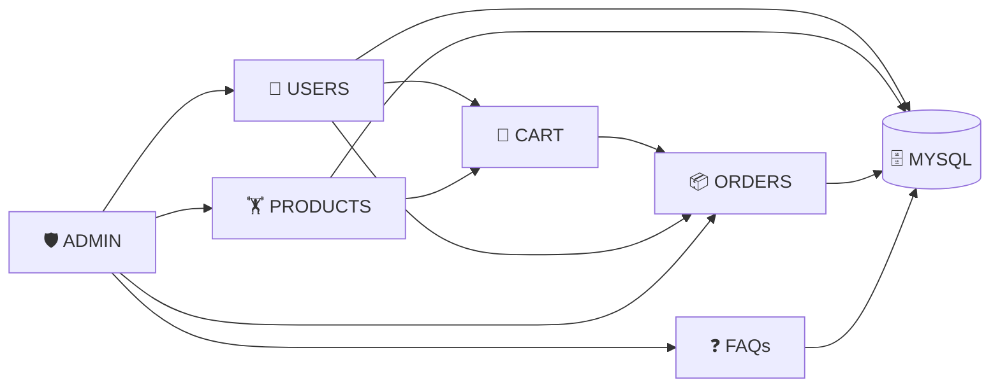

---

# 🔐 Security Architecture

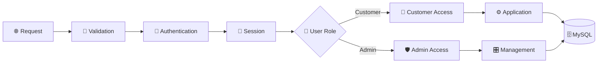

### 🛡️ Security Foundations

```text
🔐 Password Hashing
🎫 Session-Based Authentication
👥 User / Admin Role Structure
🗄️ PDO Database Connectivity
⚙️ Server-Side Processing
🔍 Authentication Status Validation
🛡️ Administrative Access Structure
```

For production deployment, HealthForge should additionally use HTTPS, CSRF protection, strict input validation, secure cookies, hardened sessions, security headers and environment-based secrets.

---

# 🧩 CRUD Matrix

| Module       | ➕ Create | 👁️ Read | ✏️ Update | 🗑️ Delete |
| ------------ | :------: | :------: | :-------: | :--------: |
| 👥 Users     |     ✅    |     ✅    |     ✅     |      ✅     |
| 🏋️ Products |     ✅    |     ✅    |     ✅     |      ✅     |
| 📦 Orders    |     ✅    |     ✅    |     ✅     |      ✅     |
| ❓ FAQs       |     ✅    |     ✅    |     ✅     |      ✅     |
| 🛒 Cart      |     ✅    |     ✅    |     ✅     |      ✅     |

---

# 🖼️ HealthForge Product Gallery

### Real assets already included inside the repository

<div align="center">

<table>

<tr>
<td align="center"><b>🥤 Whey Protein</b></td>
<td align="center"><b>🏋️ Dumbbell</b></td>
<td align="center"><b>🏃 Treadmill</b></td>
</tr>

<tr>
<td align="center"></td>
<td align="center">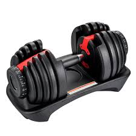</td>
<td align="center">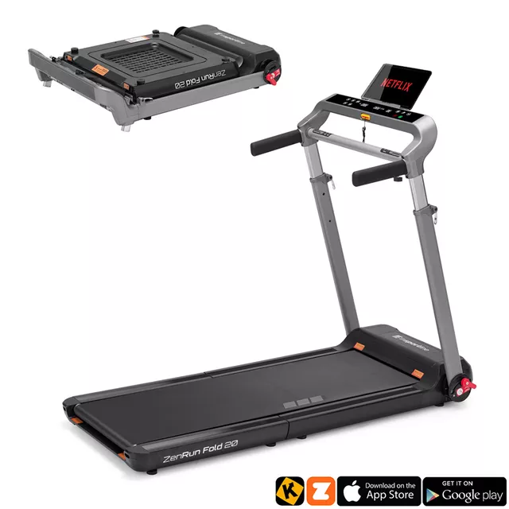</td>
</tr>

<tr>
<td align="center"><b>⌚ Fitness Tracker</b></td>
<td align="center"><b>🧘 Yoga Mat</b></td>
<td align="center"><b>💆 Massage Gun</b></td>
</tr>

<tr>
<td align="center">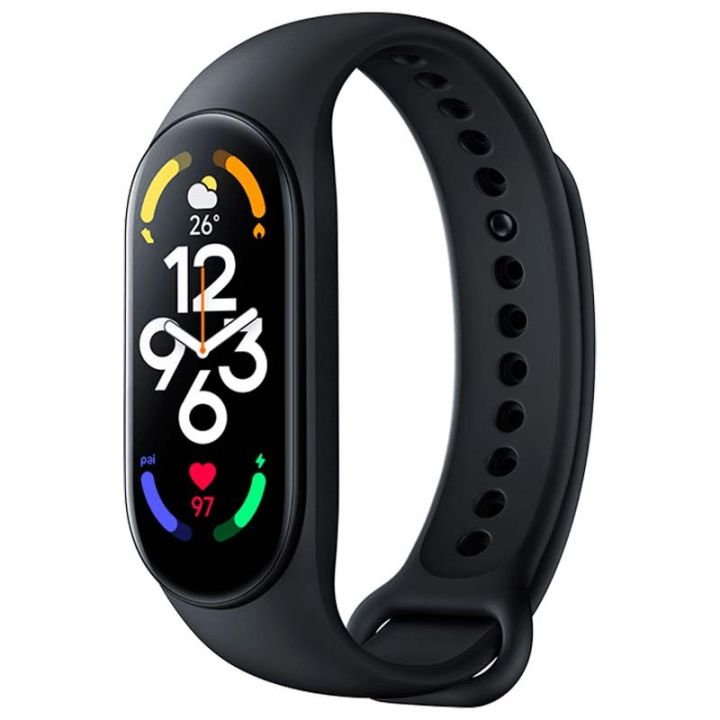</td>
<td align="center"></td>
<td align="center"></td>
</tr>

<tr>
<td align="center"><b>⚡ Energy</b></td>
<td align="center"><b>💊 Multivitamin</b></td>
<td align="center"><b>🧬 Omega</b></td>
</tr>

<tr>
<td align="center">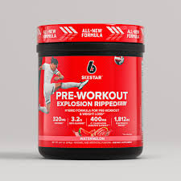</td>
<td align="center"></td>
<td align="center"></td>
</tr>

</table>

</div>

---

# 🗂️ Project Structure

<details>

<summary><b>📂 CLICK TO EXPAND THE COMPLETE HEALTHFORGE ARCHITECTURE</b></summary>

<br>

```text
HealthForge-Fitness-Web-Application/
│
├── 📁 admin/
│   ├── admin.php
│   ├── admin_header.php
│   ├── admin-users.php
│   ├── admin-products.php
│   ├── admin-orders.php
│   ├── admin-faq.php
│   │
│   ├── create_user.php
│   ├── create_product.php
│   ├── create_order.php
│   ├── create_faq.php
│   │
│   ├── update_user.php
│   ├── update_product.php
│   ├── update_order.php
│   ├── update_faq.php
│   │
│   ├── delete_user.php
│   ├── delete_product.php
│   ├── delete_order.php
│   ├── delete_faq.php
│   │
│   ├── get_order_details.php
│   ├── update_cart.php
│   └── upload_image.php
│
├── 📁 auth/
│   ├── login.php
│   ├── signup.php
│   ├── logout.php
│   └── check_status.php
│
├── 📁 cart/
│   ├── add_to_cart.php
│   ├── checkout.php
│   ├── clear_cart.php
│   ├── get_cart.php
│   ├── remove_from_cart.php
│   └── update_cart.php
│
├── 📁 config/
│   └── database.php
│
├── 📁 css/
│   ├── style.css
│   ├── admin.css
│   ├── aboutus.css
│   └── contact.css
│
├── 📁 images/
│   ├── Energy.jpg
│   ├── Multivitamin.jpg
│   ├── Omega.jpg
│   ├── Pull_up.jpg
│   ├── Whey_protein.jpg
│   ├── barbell.jpg
│   ├── carpet.jpg
│   ├── dumbbell.jpg
│   ├── epsom_salt.jpg
│   ├── fitness_tracker.jpg
│   ├── foam_roller.jpg
│   ├── gym_towel.jpg
│   ├── hero.jpg
│   ├── massage_gun.jpg
│   ├── resistant_band.jpg
│   ├── sleep_recovery.jpg
│   ├── treadmill.jpg
│   ├── vitamin.jfif
│   └── yoga_mat.jpg
│
├── 📁 js/
│   ├── app.js
│   ├── admin.js
│   └── contact.js
│
├── 📁 models/
│   ├── User.php
│   ├── Product.php
│   ├── Cart.php
│   └── Order.php
│
├── 📁 orders/
│   └── get_user_orders.php
│
├── 📁 products/
│   └── get_products.php
│
├── 📄 index.php
├── 📄 products.php
├── 📄 aboutus.php
├── 📄 contact.php
├── 🗄️ healthforge.sql
├── 🔐 generate_password_hash.php
├── 📄 .gitignore
└── 📖 README.md
```

</details>

---

# 🎮 HEALTHFORGE DEVELOPER QUEST

```text
╔════════════════════════════════════════════════════════════╗
║              🏆 HEALTHFORGE DEVELOPER QUEST 🏆           ║
╠════════════════════════════════════════════════════════════╣
║                                                            ║
║  [✓] QUEST 01  🎨 Build Responsive Frontend               ║
║  [✓] QUEST 02  🐘 Build PHP Backend                       ║
║  [✓] QUEST 03  🗄️ Forge MySQL Database                    ║
║  [✓] QUEST 04  🔐 Build Authentication                    ║
║  [✓] QUEST 05  🏋️ Create Product Engine                   ║
║  [✓] QUEST 06  🛒 Build Shopping Cart                     ║
║  [✓] QUEST 07  💳 Build Checkout                          ║
║  [✓] QUEST 08  📦 Build Order System                      ║
║  [✓] QUEST 09  🛡️ Create Admin Dashboard                  ║
║  [✓] QUEST 10  ⚙️ Implement CRUD                          ║
║  [✓] QUEST 11  🔀 Configure Git                           ║
║  [✓] QUEST 12  🐙 Deploy Repository to GitHub             ║
║                                                            ║
║             🏅 ALL MAIN QUESTS COMPLETED 🏅               ║
║                                                            ║
╚════════════════════════════════════════════════════════════╝
```

---

# 🕹️ Player Statistics

```text
╔══════════════════════════════════════════════════╗
║              PLAYER INFORMATION                 ║
╠══════════════════════════════════════════════════╣
║                                                  ║
║  PLAYER          : M.R. AHAMED                  ║
║  CLASS           : FULL-STACK DEVELOPER         ║
║  PROJECT         : HEALTHFORGE                  ║
║  SPECIALIZATION  : WEB DEVELOPMENT              ║
║  BACKEND         : PHP                          ║
║  DATABASE        : MYSQL                        ║
║  FRONTEND        : HTML / CSS / JAVASCRIPT      ║
║  VERSION CONTROL : GIT / GITHUB                 ║
║  PROJECT STATUS  : COMPLETED                    ║
║                                                  ║
╚══════════════════════════════════════════════════╝
```

---

# 🏆 Achievement Board

<div align="center">


</div>

---

# 🚀 Installation & Setup

<details>

<summary><b>⚡ STEP 1 — CLONE HEALTHFORGE</b></summary>

<br>

```bash
git clone https://github.com/Ahamed369/HealthForge-Fitness-Web-Application.git
```

```bash
cd HealthForge-Fitness-Web-Application
```

</details>

<details>

<summary><b>⚙️ STEP 2 — CONFIGURE LOCAL SERVER</b></summary>

<br>

You can use:

```text
XAMPP
WAMP
MAMP
PHP + MySQL
```

For XAMPP:

```text
C:\xampp\htdocs\HealthForge-Fitness-Web-Application\
```

Start:

```text
Apache → START
MySQL  → START
```

</details>

<details>

<summary><b>🗄️ STEP 3 — CREATE DATABASE</b></summary>

<br>

Open:

```text
http://localhost/phpmyadmin
```

Create:

```sql
CREATE DATABASE healthforge;
```

Import:

```text
healthforge.sql
```

</details>

<details>

<summary><b>🔌 STEP 4 — DATABASE CONFIGURATION</b></summary>

<br>

Default local configuration:

```php
private $host = "localhost";
private $db_name = "healthforge";
private $username = "root";
private $password = "";
```

> ⚠️ Never commit real production credentials to a public repository.

</details>

<details>

<summary><b>🌐 STEP 5 — LAUNCH HEALTHFORGE</b></summary>

<br>

Open:

```text
http://localhost/HealthForge-Fitness-Web-Application/
```

</details>

---

# ⚙️ Development Pipeline

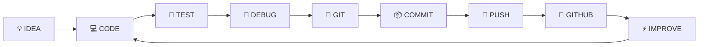

---

# 🧪 Feature Status

| System                 |    Status   |
| ---------------------- | :---------: |
| 🏠 Homepage            | 🟢 COMPLETE |
| 🔐 Authentication      | 🟢 COMPLETE |
| 🏋️ Product Catalogue  | 🟢 COMPLETE |
| 🛒 Shopping Cart       | 🟢 COMPLETE |
| 💳 Checkout            | 🟢 COMPLETE |
| 📦 Order Management    | 🟢 COMPLETE |
| 👥 User Management     | 🟢 COMPLETE |
| 🏋️ Product Management | 🟢 COMPLETE |
| ❓ FAQ Management       | 🟢 COMPLETE |
| 🛡️ Admin Dashboard    | 🟢 COMPLETE |
| 🗄️ MySQL Integration  | 🟢 COMPLETE |
| 📨 Contact Interface   | 🟢 COMPLETE |
| 🔀 Git Version Control | 🟢 COMPLETE |
| 🐙 GitHub Repository   | 🟢 COMPLETE |

---

# 🔮 HealthForge Evolution

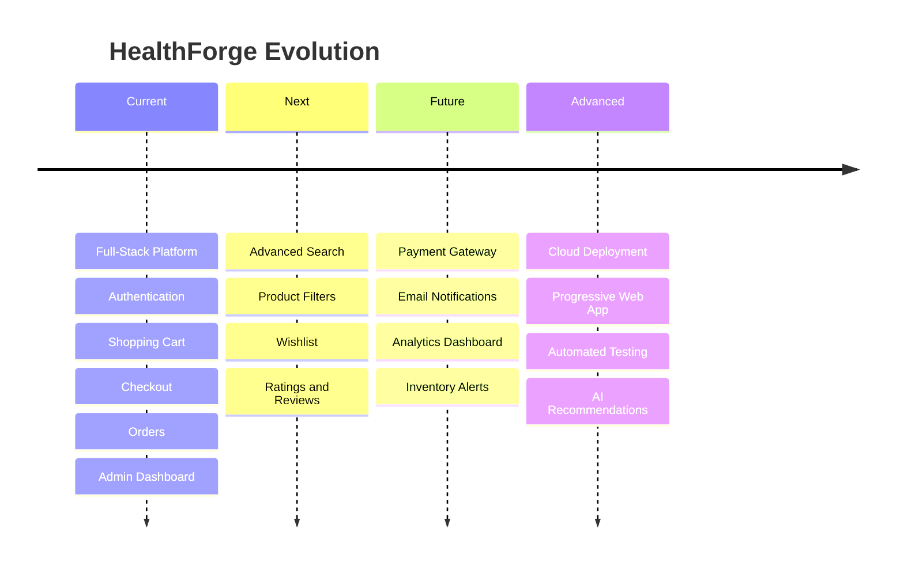

---

# 💡 Future Enhancements

| Category          | Enhancement                        |
| ----------------- | ---------------------------------- |
| 💳 Payments       | Online payment-gateway integration |
| 📧 Communication  | Automated email notifications      |
| 🔎 Search         | Advanced product search            |
| 🎯 Discovery      | Product filtering                  |
| ❤️ Engagement     | Wishlist                           |
| ⭐ Community       | Reviews and ratings                |
| 📊 Analytics      | Advanced admin analytics           |
| 📈 Business       | Sales visualization                |
| 📦 Inventory      | Stock alerts                       |
| 🧾 Documents      | Invoice generation                 |
| 🔐 Security       | CSRF protection                    |
| 🔑 Accounts       | Password-reset workflow            |
| 📱 Mobile         | Progressive Web App                |
| ☁️ Infrastructure | Cloud deployment                   |
| 🧪 Quality        | Automated testing                  |
| 🌙 Experience     | Dark mode                          |
| 🤖 Intelligence   | AI product recommendations         |

---

# 📊 Repository Pulse

<div align="center">


</div>

---

# 📡 Live Repository Signals

```text
┌──────────────────────────────────────────────────────┐
│              HEALTHFORGE REPOSITORY                  │
├──────────────────────────────────────────────────────┤
│                                                      │
│  ⭐ Stars          → GitHub Live Badge               │
│  🍴 Forks          → GitHub Live Badge               │
│  🐛 Issues         → GitHub Live Badge               │
│  📦 Repository     → GitHub Live Badge               │
│  🕒 Last Commit    → GitHub Live Badge               │
│  💻 Languages      → GitHub Live Badge               │
│                                                      │
└──────────────────────────────────────────────────────┘
```

---

# 💻 Developer Terminal

```console
ahamed@healthforge:~$ whoami

M.R. Ahamed

ahamed@healthforge:~$ role

Computer Science Undergraduate
Full-Stack Developer
Entrepreneur

ahamed@healthforge:~$ current-project

HealthForge Fitness Web Application

ahamed@healthforge:~$ backend

PHP

ahamed@healthforge:~$ database

MySQL

ahamed@healthforge:~$ frontend

HTML5
CSS3
JavaScript

ahamed@healthforge:~$ version-control

Git
GitHub

ahamed@healthforge:~$ mission

Building practical digital products
and technology-driven solutions.

ahamed@healthforge:~$ status

READY TO BUILD 🚀
```

---

# 👨‍💻 Developer

<div align="center">


<br>

## ⚡ M.R. Ahamed

### Computer Science Undergraduate • Full-Stack Developer • Entrepreneur

<br>

[](https://github.com/Ahamed369)

[](https://www.linkedin.com/in/mr-ahamed-6146a5276)

</div>

---

# 🤝 Contributing

Contributions, ideas and improvements are welcome.

```bash
# Fork the repository

git clone https://github.com/YOUR-USERNAME/HealthForge-Fitness-Web-Application.git

cd HealthForge-Fitness-Web-Application

git checkout -b feature/amazing-feature

git add .

git commit -m "Add amazing feature"

git push origin feature/amazing-feature
```

Then create a **Pull Request**.

---

# ⭐ Support HealthForge

<div align="center">

### ⭐ STAR IT

### 🍴 FORK IT

### 🐛 REPORT ISSUES

### 💡 SUGGEST FEATURES

### 🤝 CONTRIBUTE

<br>

[](https://github.com/Ahamed369/HealthForge-Fitness-Web-Application/stargazers)

[](https://github.com/Ahamed369/HealthForge-Fitness-Web-Application/forks)

</div>

---

# 🌟 HealthForge Philosophy

<div align="center">


</div>

---

# 🏋️ HealthForge Fitness Web Application

<div align="center">

### ⚡ FULL-STACK FITNESS & HEALTH E-COMMERCE PLATFORM ⚡

<br>

[](https://github.com/Ahamed369/HealthForge-Fitness-Web-Application)

</div>

---

<div align="center">

# ⚡ B U I L T ⚡

</div>

```text
██████╗  ██╗   ██╗ ██╗ ██╗      ████████╗
██╔══██╗ ██║   ██║ ██║ ██║      ╚══██╔══╝
██████╔╝ ██║   ██║ ██║ ██║         ██║
██╔══██╗ ██║   ██║ ██║ ██║         ██║
██████╔╝ ╚██████╔╝ ██║ ███████╗    ██║
╚═════╝   ╚═════╝  ╚═╝ ╚══════╝    ╚═╝

        WITH PASSION × CODE × FITNESS
```

<div align="center">


<br><br>

### `</ HEALTHFORGE >`

### Designed & Developed by **M.R. Ahamed**

`PHP` • `MySQL` • `JavaScript` • `HTML5` • `CSS3` • `Git` • `GitHub`

<br>

**© 2026 M.R. Ahamed • HealthForge**

<br>

### ⭐ STAR THE REPOSITORY IF YOU LIKE HEALTHFORGE ⭐

<br>

```text
╔══════════════════════════════════════════════════════════════╗
║                                                              ║
║                  🏋️  HEALTHFORGE  ⚡                        ║
║                                                              ║
║            BUILT WITH PASSION × CODE × FITNESS               ║
║                                                              ║
║                    M.R. AHAMED                               ║
║                                                              ║
╚══════════════════════════════════════════════════════════════╝
```

</div>
